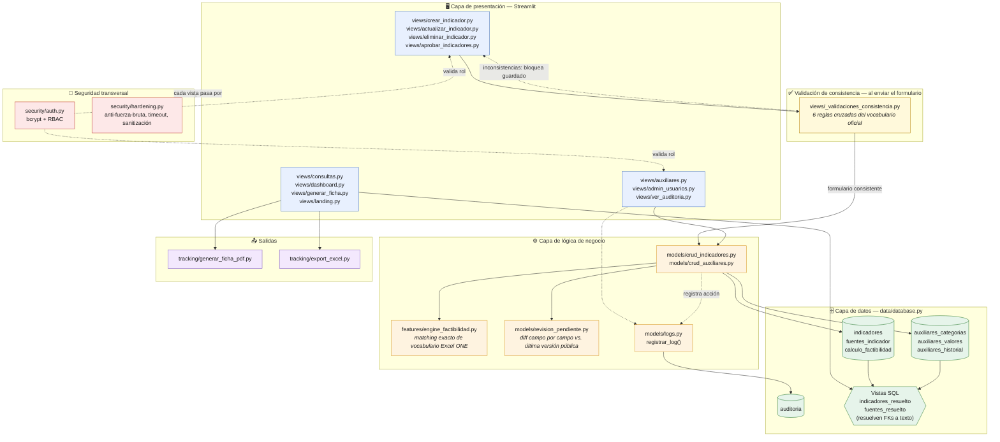
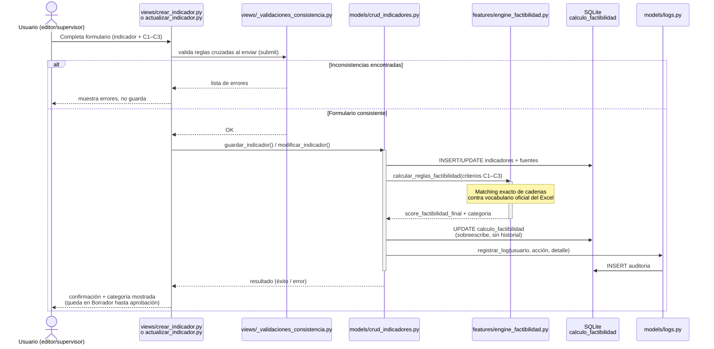
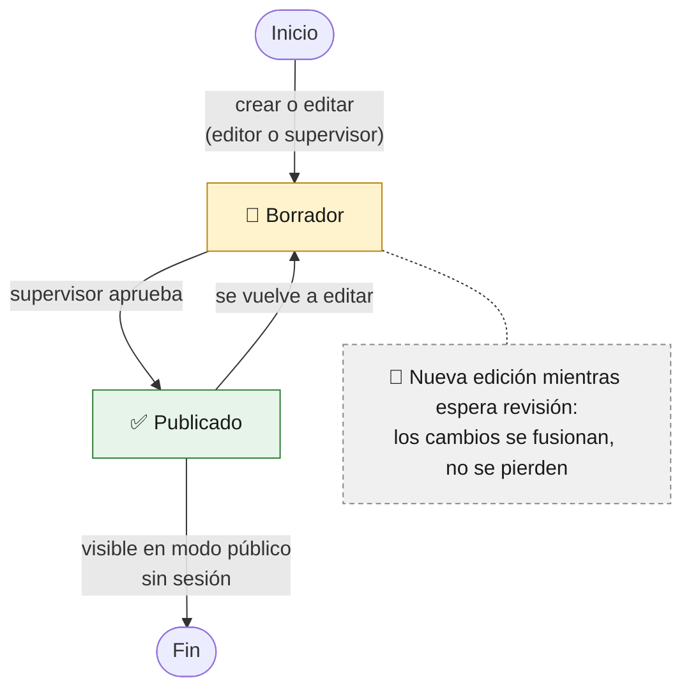

# SIDOE — Sistema Integrado de Demanda y Oferta Estadística

**Oficina Nacional de Estadística (ONE) · República Dominicana**

[](https://github.com/randymedina10/Matriz-oferta-y-Demanda-MOYD-sistematizada/actions/workflows/tests.yml)

---

## ¿Qué es SIDOE?

SIDOE es la plataforma institucional que reemplaza la gestión manual de la Matriz de Oferta y Demanda Estadística (el Excel oficial "MOYD"). Convierte un flujo basado en Excel en una aplicación web modular, segura y auditable, construida sobre Python, SQLite y Streamlit.

El sistema permite registrar, editar y eliminar indicadores estadísticos, evaluar su factibilidad de producción de forma automática, generar fichas técnicas en PDF, exportar datos a Excel y visualizar el estado del inventario estadístico en dashboards interactivos — todo con trazabilidad completa de los cambios.

> **Acceso público por defecto:** cualquiera que entre al sistema **sin iniciar sesión** ve la landing institucional y luego Consulta, Ficha PDF y Dashboard de solo lectura — pensado para el enlace público en la página web de la ONE. No hace falta ninguna cuenta para consultar el inventario; crear o editar indicadores exige login como `editor` o `supervisor` (queda en Borrador hasta que un `supervisor` lo aprueba); Auditoría y Administrar Usuarios exigen `administrador`.

---

## Funcionalidades principales

| Módulo | Descripción |
|---|---|
| **CRUD de Indicadores** | Crear, actualizar, eliminar y desactivar indicadores con validación en cada paso |
| **Motor de Factibilidad** | Cálculo automático de Factibilidad I / II / III replicando la lógica del Excel oficial ONE |
| **Flujo de aprobación (Borrador → Publicado)** | Todo lo creado o editado por `editor`/`supervisor` queda en `borrador`, oculto del público, hasta que un `supervisor` lo revisa y aprueba desde "Aprobar Indicadores" — con detalle campo por campo de qué cambió |
| **Validaciones de consistencia** | Reglas cruzadas entre campos relacionados del vocabulario oficial (no solo obligatoriedad), validadas al enviar el formulario de crear/actualizar indicador — ver `views/_validaciones_consistencia.py` |
| **Auto-bloqueo por eliminaciones masivas** | Un `supervisor` que elimina 5 indicadores seguidos se desactiva automáticamente y su sesión se cierra al instante; requiere reactivación por un `administrador`. Eliminaciones masivas legítimas (TI) tienen su propio script fuera de la UI — ver DESPLIEGUE_PRODUCCION.md §3.4 |
| **Landing institucional** | Pantalla de bienvenida pública (SIDOE) con accesos rápidos a Consulta, Ficha y Dashboard, generadores de demanda y estadísticas del sistema |
| **Fichas PDF** | Generación de fichas técnicas individuales por indicador en formato PDF institucional |
| **Exportación Excel** | Exporta hojas de Indicadores, Fuentes, Factibilidad y **Diccionario de Datos** (conforme a los lineamientos de la ONE) en un solo archivo `.xlsx` |
| **Dashboard** | Gráficos interactivos por dominio, subdominio, sector IOE y categoría de factibilidad |
| **Auditoría** | Trazabilidad completa de todas las acciones administrativas (paginada a nivel SQL, con retención configurable) |
| **Acceso público** | Consulta, Ficha PDF y Dashboard disponibles sin login, con landing institucional como puerta de entrada |
| **Gestión de Usuarios** | Administración de cuentas `editor`, `supervisor` y `administrador` (login requerido; solo `administrador` accede a este panel) |
| **Auxiliares** | Catálogos controlados editables para campos categóricos (propagación automática) |
| **Campos Personalizados** | Sistema EAV para agregar campos adicionales sin modificar el esquema |
| **Backup** | Backup rotado de la BD accesible desde el panel de administración |

---

## Arquitectura

### Vista de capas



### Flujo: cálculo de factibilidad (Motor)

El Motor de Factibilidad **nunca se ejecuta desde una vista directamente**: siempre pasa por la capa de modelos, que orquesta la escritura del indicador, el cálculo y la auditoría dentro de la misma transacción.



> **Regla de negocio:** `score ≥ 91` → *Factibilidad I* · `score ≥ 70` → *Factibilidad II* · `score < 70` o sin datos → *Factibilidad III*.

### Flujo: publicación con aprobación del supervisor (Borrador → Publicado)

Reestructuración de roles de agosto-2026: ningún cambio de `editor` o
`supervisor` llega directo al público. Todo indicador **creado o editado**
(incluyendo agregar/editar/eliminar una fuente, un eje/política adicional o
un campo personalizado) queda en `estado_publicacion = 'borrador'` hasta
que un `supervisor` lo revisa y aprueba desde "✅ Aprobar Indicadores". Los
indicadores publicados vía ETL heredan `publicado` por defecto (son datos
históricos ya validados del Excel oficial).



`models/revision_pendiente.py` calcula, campo por campo, qué cambió
respecto a la última versión pública (`revision_detalle`, JSON) y clasifica
cada borrador como 🆕 *nuevo* (nunca fue público) o ✏️ *actualizado*
(edición de algo que el público ya veía) — así el supervisor no tiene que
abrir "Actualizar Indicador" y comparar a ojo. Desde la propia pantalla de
aprobación puede saltar directo a "Actualizar Indicador" con el botón
"✏️ Editar antes de aprobar" si nota algo que corregir antes de publicar.

---

### Estructura de directorios

```
sidoe/
├── app.py                    # Punto de entrada Streamlit (menú, RBAC, timeout de sesión)
├── config.py                 # Fuente única de verdad para configuración
├── pyproject.toml            # Instalación como paquete editable
├── sidoe.pth                 # Método alternativo sin pip (ver INSTALACION.md)
│
├── data/
│   ├── database.py           # Capa de BD: conexión, migraciones idempotentes, vistas SQL
│   ├── diccionario_datos.py  # Catálogo de campos exportado en el Excel de salida
│   └── migraciones_historicas/ # Scripts de un solo uso, idempotentes (ver §Migraciones históricas)
│       ├── ETL_migracion.py  # Migración histórica inicial desde el Excel oficial ONE
│       ├── diagnostico_normalizacion_p4.py # Script de diagnóstico de solo lectura
│       ├── migracion_backfill_indicadores_duplicados.py
│       ├── migracion_backfill_contenido_referenciados.py
│       ├── migracion_backfill_pnpsp_campos_demanda.py
│       ├── reporte_antes_despues_contenido_referenciados.py
│       ├── eliminacion_masiva_indicadores.py # Script de TI, fuera de la UI (ver DESPLIEGUE_PRODUCCION.md §3.4)
│       ├── fix_auditoria_fk.py
│       └── migracion_v2_ajustes.py
│
├── features/
│   └── engine_factibilidad.py # Motor de cálculo C1–C3.2 (cadenas exactas del Excel ONE)
│
├── models/
│   ├── crud_indicadores.py   # CRUD de indicadores y fuentes (transaccional)
│   ├── crud_auxiliares.py    # Gestión del sistema de catálogos auxiliares
│   ├── logs.py               # Registro de auditoría en BD
│   └── revision_pendiente.py # Diff campo por campo vs. última versión pública (Aprobar Indicadores)
│
├── security/
│   ├── auth.py                # Autenticación bcrypt, RBAC, política de contraseñas
│   ├── crear_admin.py         # Alta del administrador inicial (interactivo o por env vars)
│   ├── totp.py                 # Primitivas 2FA (TOTP) — hoy solo accesible en la práctica vía Administrar Usuarios (administrador)
│   └── hardening.py           # Anti-fuerza-bruta, timeout de sesión, sanitización
│
├── utils/
│   ├── helpers.py            # Utilidades puras (sin BD ni Streamlit)
│   ├── backup.py             # Backup consistente y rotación automática
│   ├── archivar_auditoria.py # Retención/archivado CSV de la tabla auditoria
│   └── ui_mensajes.py        # Mensajes de éxito/advertencia que sobreviven a st.rerun()
│
├── views/                    # 12 vistas de menú + 2 módulos privados compartidos
│   ├── landing.py             # Landing institucional pública (modo sin sesión)
│   ├── crear_indicador.py / actualizar_indicador.py / eliminar_indicador.py
│   ├── aprobar_indicadores.py # Aprobación de publicación (rol supervisor)
│   ├── ver_indicadores_desactivados.py
│   ├── consultas.py / dashboard.py / generar_ficha.py
│   ├── auxiliares.py / admin_usuarios.py / ver_auditoria.py
│   ├── _form_indicador_shared.py     # Helpers de formulario compartidos entre crear/actualizar
│   └── _validaciones_consistencia.py # Reglas cruzadas del vocabulario oficial, validadas al enviar el formulario
│
├── tracking/                 # Generación de PDF y exportación Excel
├── docs/                     # Manual de uso, instructivo de consistencia y FAQs en PDF
├── tests/                    # 39 archivos, 555 tests (10 marcados requiere_bd_local)
├── .github/workflows/        # CI: ruff + pytest sobre esquema vacío
└── .streamlit/
    └── config.toml           # Configuración de seguridad del servidor Streamlit
```

### Base de datos (SQLite + WAL)

| Tabla | Descripción |
|---|---|
| `indicadores` | Un registro por indicador estadístico |
| `fuentes_indicador` | Fuentes de datos (1:N por indicador) |
| `calculo_factibilidad` | Resultado del Motor por indicador (1:1, se sobreescribe) |
| `auxiliares_categorias` / `auxiliares_valores` | Catálogos controlados |
| `indicador_ejes_politicas` | Pares Eje/Política por indicador (bridge table) |
| `indicador_campos_personalizados` / `fuente_campos_personalizados` | EAV |
| `usuarios` | Cuentas con hash bcrypt (+ columnas opcionales de 2FA/TOTP) |
| `auditoria` | Log inmutable de acciones |

---

## Seguridad

SIDOE implementa múltiples capas de seguridad adecuadas a su arquitectura:

### Autenticación y contraseñas
- **Hashing bcrypt** con salt aleatorio para todas las contraseñas (migración automática desde SHA-256 legado en primer login).
- **Política de contraseñas** obligatoria: mínimo 8 caracteres, mayúscula, número y carácter especial.
- **Tiempo de respuesta constante** en login para no revelar si un usuario existe.
- **2FA (TOTP)**: mecanismo disponible para cualquier rol a nivel de código (`security/totp.py` + `security/auth.py` no distinguen rol), pero en la práctica solo se configura desde "Administrar Usuarios", que únicamente `administrador` tiene en su menú — así que hoy es efectivamente exclusivo de cuentas `administrador`. Dos modalidades: (1) opt-in, autoservicio: el propio administrador activa verificación en dos pasos sobre su cuenta (QR compatible con Google Authenticator/Authy); (2) obligatorio: un administrador puede exigir 2FA a cualquier usuario del sistema (de cualquier rol) desde el mismo panel — al iniciar sesión, ese usuario es forzado a configurarlo antes de poder acceder al sistema, sin importar que su propio rol no tenga acceso al panel de autoservicio. Al activarse, se generan 10 códigos de respaldo de un solo uso (mostrados una única vez, hasheados en BD) por si se pierde acceso a la app autenticadora; el admin puede regenerarlos. Quitar la exigencia de 2FA también desactiva el TOTP ya configurado del usuario (no solo el flag a futuro). Ver `security/totp.py` y `security/auth.py`.

### Protección anti-fuerza-bruta
- Bloqueo temporal de 15 minutos tras 5 intentos fallidos en ventana de 5 minutos.
- Contador de intentos restantes visible al usuario.
- Todos los intentos fallidos quedan registrados en la tabla `auditoria`.

### Sesiones
- **Timeout de inactividad** de 60 minutos: la sesión se cierra automáticamente.
- Indicador visual del tiempo restante en el sidebar.
- Cierre de sesión limpia todo el estado de Streamlit.

### Control de acceso (RBAC)
- Acceso público sin sesión a Consulta / Ficha PDF / Dashboard (solo lectura); `editor`, `supervisor` y `administrador` requieren login, cada uno con su propio subconjunto de vistas (ver "Estructura de roles" más abajo).
- El decorador `@require_role` protege cada vista en el servidor.
- Menú lateral muestra solo las opciones del rol activo (o las públicas, sin sesión).
- Protección contra auto-eliminación de cuenta propia.

### Validación de entradas
- Sanitización de caracteres de control en todos los campos de texto libre.
- Validación de esquema `http/https` en URLs.
- Restricción de caracteres permitidos en nombres de usuario.
- Truncado defensivo de campos al límite definido (255 / 2000 chars).

### Base de datos
- **SQL 100% parametrizado**: cero interpolación de cadenas en consultas.
- `PRAGMA foreign_keys = ON` activo en cada conexión.
- `PRAGMA journal_mode = WAL` para consistencia en escrituras concurrentes.
- **Permisos de archivo `600`** (rw-------) verificados y corregidos al arrancar.

### Configuración Streamlit
- `enableXsrfProtection = true` (protección anti-XSRF incorporada).
- `enableCORS = true` — requerido para que `enableXsrfProtection` funcione correctamente (ambos ajustes son interdependientes en Streamlit); en producción detrás de proxy reverso, evaluar `enableCORS = false` + `trustedOrigins`.
- `gatherUsageStats = false` (sin telemetría).
- Tamaño máximo de carga limitado a 10 MB.

### Backup
- Backup consistente vía API SQLite (seguro con WAL activo).
- Rotación automática: conserva los últimos 7 backups.
- Panel de backup accesible desde la interfaz de administrador.
- Permisos `600` aplicados a cada archivo de backup.
- **Retención de auditoría**: `utils/archivar_auditoria.py` exporta a CSV
  y purga los registros más antiguos que el umbral configurado (default
  365 días) — no se ejecuta
  automáticamente, ver
  [`DESPLIEGUE_PRODUCCION.md`](DESPLIEGUE_PRODUCCION.md) sección 3.2.
- **Restauración**: siempre manual a nivel de filesystem/TI, nunca desde la
  UI. Ver [`DESPLIEGUE_PRODUCCION.md`](DESPLIEGUE_PRODUCCION.md) para el
  procedimiento paso a paso.

### Despliegue en producción (HTTPS/TLS)
- Streamlit no termina TLS por sí mismo; en producción debe correr detrás
  de un reverse proxy (nginx/Apache). Ver
  [`DESPLIEGUE_PRODUCCION.md`](DESPLIEGUE_PRODUCCION.md) para la
  configuración de nginx, systemd y el checklist previo a go-live.

---

## Instalación

### Requisitos
- Python 3.10 o superior
- Sistema operativo: Linux (producción), macOS o Windows (desarrollo)

### Pasos

```bash
# 1. Clonar el repositorio
git clone https://github.com/randymedina10/Matriz-oferta-y-Demanda-MOYD-sistematizada.git
cd Matriz-oferta-y-Demanda-MOYD-sistematizada

# 2. Crear entorno virtual (recomendado)
python3 -m venv venv
source venv/bin/activate   # Linux/macOS
# venv\Scripts\activate    # Windows

# 3. Instalar dependencias
pip install -r requirements.txt

# 4. Instalar el paquete en modo editable
pip install -e .

# 5. Crear usuario administrador inicial
python3 -m security.crear_admin
# (usuarios adicionales de prueba, p. ej. rol editor, se crean iniciando
#  sesión como administrador y usando el panel "👥 Administración de
#  Usuarios" dentro de la propia app — ya no hace falta un script aparte)

# 6. (Opcional) Migrar los datos históricos desde el Excel oficial
python3 -m data.migraciones_historicas.ETL_migracion

# 7. Levantar la aplicación
streamlit run app.py
```

La aplicación queda disponible en `http://localhost:8501`.

> Para métodos de instalación alternativos (sin `pip`, vía archivo `.pth`) y
> el detalle de los scripts de migración, ver [INSTALACION.md](INSTALACION.md).
> Si la funcion "PIP" no funciona agregar "python -m" ya que puede que no esten incluidas las variables de entorno.
---

## Tests

```bash
# Instalar dependencias de desarrollo (incluye pytest y pytest-timeout)
pip install -r requirements-dev.txt

# Correr la suite completa (555 tests, 10 requieren BD local — ver nota abajo)
pytest
```

> La suite usa `sidoe.db` (raíz del proyecto) como plantilla de datos —
> nunca se modifica, cada test opera sobre una copia temporal. Ese archivo
> **no se versiona** (ver `.gitignore`), así que antes de correr los tests
> por primera vez genera uno local con:
> ```bash
> python3 -m data.migraciones_historicas.ETL_migracion   # carga los indicadores del Excel oficial
> python3 -m security.crear_admin # crea el usuario administrador
> ```
>
> 10 tests están marcados `@pytest.mark.requiere_bd_local` porque asumen
> datos migrados reales (ej. `assert total > 800`) que solo existen en tu
> copia local de `sidoe.db`. El pipeline de CI (GitHub Actions) corre
> sobre un clon limpio sin esos datos, así que los excluye:
> ```bash
> pytest -m "not requiere_bd_local"
> ```

### Cobertura

Cobertura de la capa de lógica de negocio (ver `.coveragerc` — excluye
`app.py`, `views/*` y scripts de migración/seed, que requieren
`streamlit.testing.v1.AppTest` para medirse):

```bash
pytest -m "not requiere_bd_local" --cov --cov-report=term
```

**Total: 90.1%** (2369 statements, 235 sin cubrir — medido en clon limpio,
545/545 tests aplicables pasando, 10 deselected vía `requiere_bd_local`).
`security/hardening.py`, `config.py`, `data/diccionario_datos.py`,
`features/engine_factibilidad.py` y `tracking/export_excel.py` están al
100%; `models/crud_indicadores.py` al 97.4%; `security/auth.py` al 98.8%.
Puntos con cobertura baja restantes, dejados a propósito:
- `data/database.py` (73.9%): lo sin cubrir son ramas de migraciones
  idempotentes de una sola vez (`ALTER TABLE ... ADD COLUMN` sobre bases
  creadas antes de cada campo), ya aplicadas en producción. Forzarlas
  requeriría reconstruir esquemas pre-migración solo para inflar el
  número — no agregan confianza real sobre el sistema en su estado actual.
- `models/crud_auxiliares.py` (87.3%) y `utils/backup.py` (81.8%):
  rutas de error/corrupción de bajo tráfico, pendiente si se justifica
  el esfuerzo.
- `models/revision_pendiente.py` (83.6%): agregado con la reestructuración
  de roles (agosto-2026) para el resumen de cambios en Aprobar
  Indicadores; lo sin cubrir son ramas defensivas de JSON corrupto/antiguo
  en `leer_cambios()`, mismo criterio de bajo tráfico que el resto de esta
  lista.
- `utils/archivar_auditoria.py` (80.8%) y `security/totp.py` (89.7%):
  agregados en julio 2026; lo sin cubrir son ramas de manejo de errores
  de disco/formato de bajo tráfico, mismo criterio que backup.py arriba.
- `data/migraciones_historicas/diagnostico_normalizacion_p4.py` está excluido de la medición
  (`.coveragerc`): es un script de diagnóstico de solo lectura, del mismo
  tipo que `ETL_migracion.py`, no un módulo de la aplicación en ejecución.

## Stack tecnológico

| Componente | Tecnología |
|---|---|
| Interfaz web | Streamlit |
| Base de datos | SQLite (WAL mode) |
| Autenticación | bcrypt |
| Gráficos | Plotly |
| Generación PDF | fpdf2 |
| Exportación Excel | openpyxl |
| Análisis de datos | pandas |
| 2FA (TOTP) | pyotp + qrcode |

---

## Datos migrados

- **855 indicadores** y **1,077 fuentes** del Excel oficial ONE migrados automáticamente (cifras confirmadas en producción tras corrección del bug de ETL que agrupa fuentes por `Código`).
- **30 campos híbridos** (17 en `indicadores`, 13 en `fuentes_indicador`) con resolución de FK vía vistas SQL (`indicadores_resuelto`, `fuentes_resuelto`) — ver `CAMPOS_HIBRIDOS_INDICADORES` / `CAMPOS_HIBRIDOS_FUENTES` en `config.py`.
- Motor de factibilidad corregido (bugs identificados y solucionados respecto a la implementación original del Excel).

---

## Migraciones históricas — Indicadores referenciados

Scripts de un solo uso (`data/migraciones_historicas/`) para alinear, sobre
una BD **ya poblada** en producción, los indicadores vinculados vía
"Indicadores duplicados" en el Excel oficial. Ya se ejecutaron sobre
producción; se documentan aquí por trazabilidad y porque son seguros de
volver a correr (todos son idempotentes).

**No deduplican ni agrupan filas para conteos** — cada indicador sigue
existiendo por separado en Consultas/Dashboard, ya que cada fila representa
una relación real e independiente indicador-generador de demanda. Solo
sincronizan el vínculo y, después, el contenido compartido (fuente y
criterios de factibilidad).

1. **Vincular los indicadores** (backfill de `indicadores_duplicados`,
   cruzando por `codigo` contra el Excel oficial):
   ```bash
   python -m data.migraciones_historicas.migracion_backfill_indicadores_duplicados <ruta_excel_oficial>
   ```

2. **(Opcional, recomendado) Previsualizar** qué cambiaría antes de tocar
   contenido — reporte de solo lectura, no escribe en la BD:
   ```bash
   python -m data.migraciones_historicas.reporte_antes_despues_contenido_referenciados <ruta_excel_oficial> [ruta_salida.csv]
   ```
   Si no se indica ruta de salida, genera `reporte_backfill_contenido_<timestamp>.csv`
   en el directorio actual. Reutiliza la misma función de decisión
   (`resolver_direccion`) que el backfill real, así que el preview es fiel.

3. **Sincronizar el contenido** (fuente + criterios de factibilidad) de los
   pares ya vinculados en el paso 1:
   ```bash
   python -m data.migraciones_historicas.migracion_backfill_contenido_referenciados <ruta_excel_oficial>
   ```
   Reglas de resolución cuando dos indicadores referenciados difieren: gana
   el de mayor `score_factibilidad_final`; en caso de empate exacto con
   contenido distinto, gana el lado del generador ODS sobre CMV/END/PNPSP.
   Pares en `EXCLUSIONES_CONOCIDAS` (relaciones parciales, no duplicados
   reales — confirmado contra el propio texto del Excel) no se tocan.

Una vez vinculado, cualquier edición futura de un indicador referenciado
desde la UI dispara automáticamente `sincronizar_contenido_referenciados()`
— estos scripts solo hacen falta para alinear datos históricos, no para el
flujo normal de edición.

---

## Estructura de roles

Reestructuración de agosto-2026 (rol `supervisor` nuevo, entre `editor` y
`administrador`): `administrador` deja de tener CRUD de indicadores —
queda enfocado en gestión de usuarios y auditoría, mientras que
`supervisor` es quien aprueba/publica y gestiona lo operativo del día a
día (incluyendo Auxiliares y eliminación/desactivación de indicadores).

| Rol | Acceso |
|---|---|
| *(sin sesión — público)* | Landing institucional, Consulta, Ficha PDF, Dashboard — vista por defecto, sin login |
| `editor` | Consulta, Ficha PDF, Dashboard + Crear / Actualizar indicadores (queda en Borrador hasta aprobación) |
| `supervisor` | Todo lo de `editor` + Eliminar Indicador, **Aprobar Indicadores** (publicación), Indicadores Desactivados, Auxiliares |
| `administrador` | Consulta, Ficha PDF, Dashboard + Ver Auditoría, Administrar Usuarios (incluye 2FA/TOTP propio y ajeno) — **sin** acceso a Crear/Actualizar/Eliminar indicadores |

---

*Sistema desarrollado por Randy A. Medina para implementarse en la Oficina Nacional de Estadística (ONE) · República Dominicana.*
